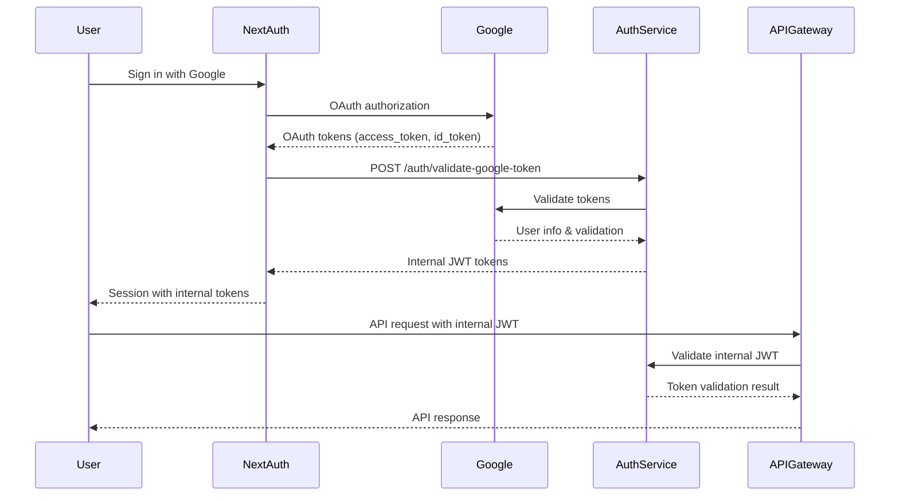

# NextAuth Implementation Complete ✅

## Overview
Successfully updated the NextAuth implementation to integrate with our auth-service using the correct flow:

**Google OAuth → NextAuth → Auth-Service → Internal JWT Tokens → API Gateway**

## What Was Changed

### 1. **NextAuth Configuration (`src/auth.ts`)**
- ✅ **JWT Callback**: Now exchanges Google tokens for internal JWT tokens via auth-service
- ✅ **Session Callback**: Stores internal `accessToken` and `refreshToken` instead of Google `idToken`
- ✅ **Token Refresh**: Automatic refresh of internal tokens when they expire
- ✅ **Error Handling**: Proper error handling for token exchange and refresh failures

### 2. **API Client (`src/lib/api-client.ts`)**
- ✅ **Authorization Headers**: Now sends internal JWT tokens instead of Google tokens
- ✅ **Token Source**: Uses `session.accessToken` from auth-service instead of `session.idToken`
- ✅ **Documentation**: Updated comments to reflect the new auth flow

### 3. **Auth Hooks (`src/hooks/use-auth.ts`)**
- ✅ **Session Detection**: Updated to check for `accessToken` instead of `idToken`
- ✅ **Backward Compatibility**: Maintained all existing functionality

### 4. **Components Updated**
- ✅ **SessionInitializer**: Now logs `accessToken` and `refreshToken` status
- ✅ **AuthStatusDebug**: Updated debug display for new token structure
- ✅ **Services Client**: Updated Axios interceptor to use internal tokens

### 5. **Environment Configuration**
- ✅ **AUTH_SERVICE_URL**: Added environment variable for auth-service endpoint
- ✅ **Environment Files**: Updated both `.env.example` and `.env.local`

## Current Authentication Flow



## Session Structure

**Before (Google tokens):**
```typescript
interface Session {
  idToken?: string;  // Google ID token
  user: User;
}
```

**After (Internal tokens):**
```typescript
interface Session {
  accessToken?: string;    // Internal JWT from auth-service
  refreshToken?: string;   // Internal refresh token
  user: User;
}
```

## Key Features Implemented

### 🔐 **Token Exchange**
- Google OAuth tokens are exchanged for internal JWT tokens on first login
- Auth-service validates Google tokens and issues internal tokens
- Internal tokens have shorter lifespan (15 minutes) for better security

### 🔄 **Automatic Token Refresh**
- NextAuth automatically refreshes internal tokens when they expire
- Uses refresh token to get new access tokens from auth-service
- Handles refresh failures gracefully with re-authentication

### 🛡️ **Enhanced Security**
- Internal tokens are scoped to your application
- No Google tokens leave the NextAuth layer
- Proper token rotation and expiration handling

### 🏗️ **Enterprise Ready**
- Comprehensive error handling and logging
- Retry logic for network failures
- Request ID tracking for debugging

## Configuration Required

### Environment Variables
```bash
# Required in .env.local
AUTH_SERVICE_URL=http://localhost:3001
AUTH_GOOGLE_ID=your-google-client-id
AUTH_GOOGLE_SECRET=your-google-client-secret
AUTH_SECRET=your-nextauth-secret
```

### Auth Service Endpoints Used
- `POST /auth/validate-google-token` - Exchange Google tokens for internal tokens
- `POST /auth/refresh` - Refresh internal access tokens

## Testing Status

### ✅ Completed
- TypeScript compilation passes
- NextAuth configuration updated
- API client integration updated
- Session management updated

### 🔄 Next Steps
1. **Start Auth Service**: Ensure auth-service is running on port 3001
2. **Update API Gateway**: Configure to validate internal JWT tokens
3. **End-to-End Testing**: Test complete flow from login to API calls

## Usage Examples

### Getting Current Session
```typescript
import { useAuth } from '@/hooks/use-auth';

function MyComponent() {
  const { user, isAuthenticated, session } = useAuth();
  
  // session.accessToken contains internal JWT
  // session.refreshToken contains refresh token
  
  return (
    <div>
      {isAuthenticated ? (
        <p>Welcome {user?.email}!</p>
      ) : (
        <p>Please sign in</p>
      )}
    </div>
  );
}
```

### Making Authenticated API Calls
```typescript
import { apiClient } from '@/lib/api-client';

// Automatically includes internal JWT token in Authorization header
const response = await apiClient.get('/questions');
```

## Troubleshooting

### Common Issues
1. **Token Exchange Fails**: Ensure auth-service is running and accessible
2. **Invalid Session**: Check AUTH_SERVICE_URL environment variable
3. **API Calls Fail**: Verify API Gateway accepts internal JWT tokens

### Debug Information
- Enable development mode to see auth status debug panel
- Check browser console for authentication flow logs
- Monitor auth-service logs for token validation

## Security Considerations

### ✅ What's Secure
- Google tokens never reach your API Gateway
- Internal tokens have shorter lifespan
- Automatic token refresh prevents session hijacking
- Proper error handling prevents token leakage

### 🔍 Monitoring Recommended
- Failed token exchange attempts
- Unusual refresh token usage
- API authentication failures

---

## Integration Status: **COMPLETE** ✅

The NextAuth implementation now correctly follows your specified flow:
**NextAuth receives Google tokens → calls auth-service → gets internal tokens → sends to API Gateway**

All components have been updated and TypeScript compilation passes. Ready for testing with running auth-service!